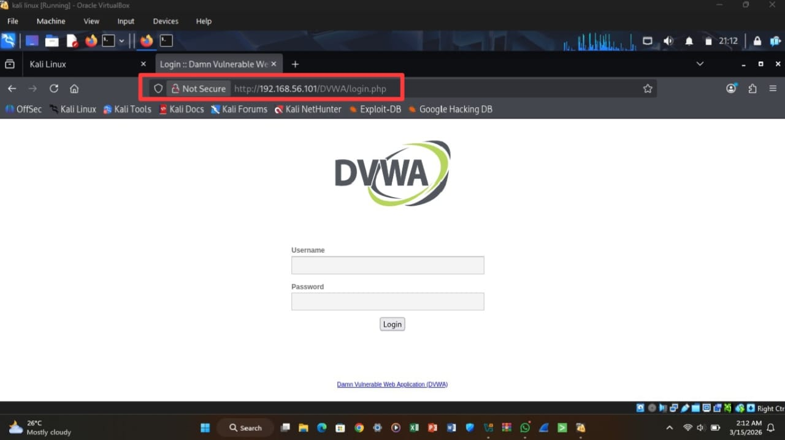
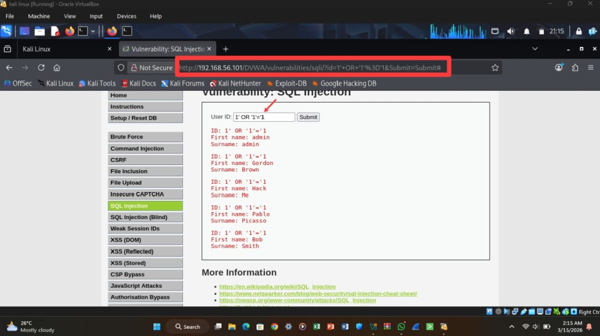
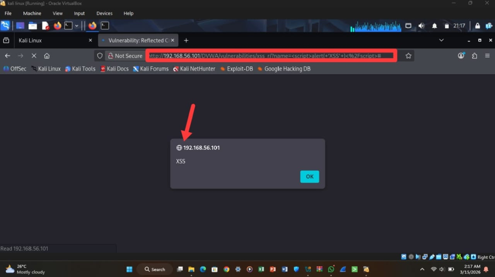
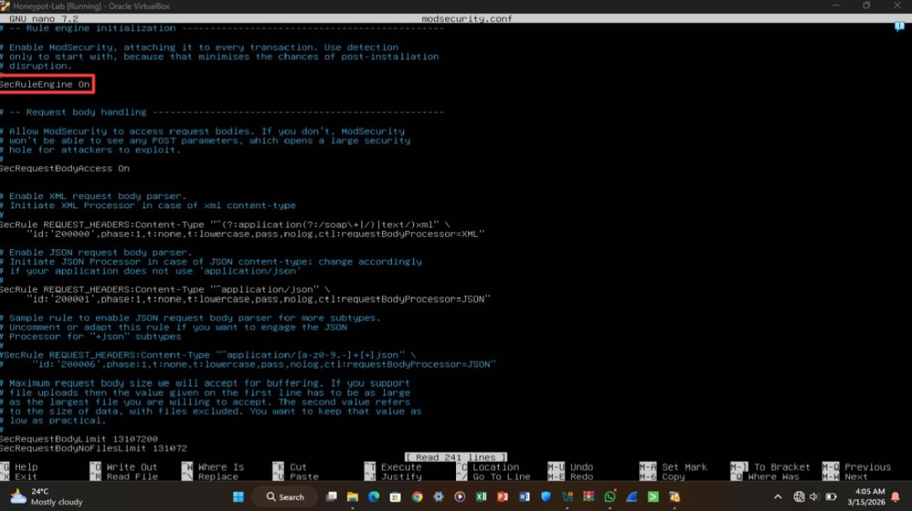
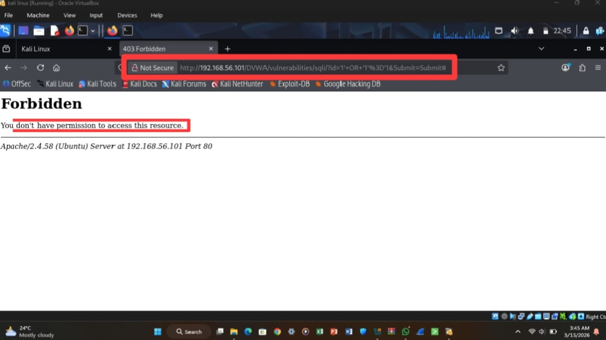
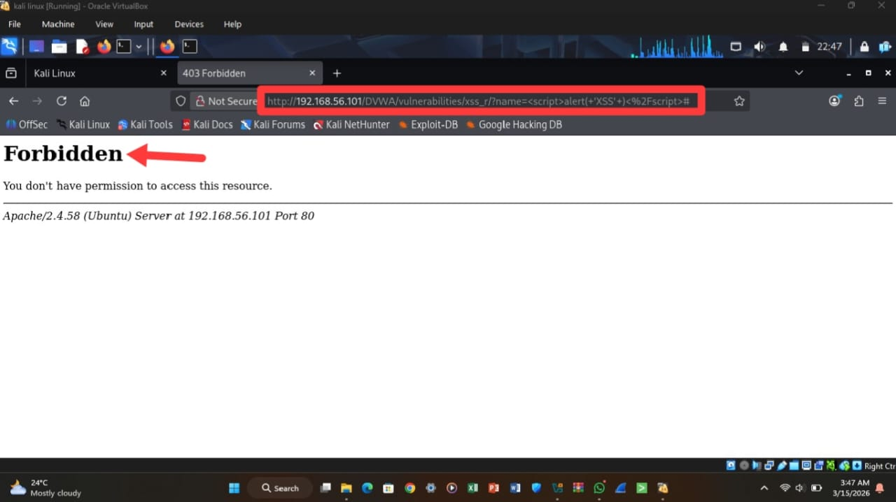
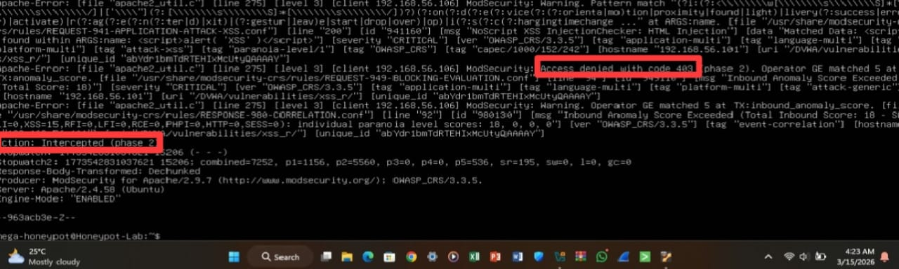

# DVWA Web Application Attack and Defense Lab

## Table of Contents
1. [Quick Start / Highlights](#quick-start--highlights)
2. [Introduction](#introduction)
3. [Objectives](#objectives)
4. [Lab Environment](#lab-environment)
5. [Prerequisites / Setup Instructions](#prerequisites--setup-instructions)
6. [Attack Simulation](#attack-simulation)
   - [SQL Injection](#sql-injection)
   - [Cross-Site Scripting (XSS)](#cross-site-scripting-xss)
7. [Defensive Implementation](#defensive-implementation)
8. [Testing Methodology](#testing-methodology)
9. [Attack Blocking Validation](#attack-blocking-validation)
10. [Log Evidence](#log-evidence)
11. [Key Takeaways](#key-takeaways)
12. [Conclusion](#conclusion)
13. [License](#license)

---

## Quick Start / Highlights
**Purpose:** Hands-on lab to simulate web application attacks and test defenses using ModSecurity WAF.  

**Environment:**
- Attacker: Kali Linux
- Target: Ubuntu Server with Apache2 and DVWA
- WAF: ModSecurity

**Key Skills Demonstrated:**
- Performing SQL Injection and Cross-Site Scripting (XSS) attacks
- Configuring and validating a Web Application Firewall
- Reviewing logs and documenting security findings

**Lab Workflow:**
1. Deploy DVWA on Ubuntu and initialize the database.
2. Perform SQL Injection and XSS attacks from Kali Linux.
3. Install and configure ModSecurity WAF.
4. Re-run attacks to verify they are blocked.
5. Review audit logs to confirm detection.
6. Capture screenshots and document findings.

*Note:* Screenshots and logs are included inline under the relevant sections for clarity.

---

## Introduction
This project documents a hands-on cybersecurity lab focused on identifying and defending against web application attacks. DVWA was used to simulate vulnerabilities, and ModSecurity served as a Web Application Firewall to detect and block malicious activity.

---

## Objectives
- Identify SQL Injection and XSS vulnerabilities in DVWA.
- Configure ModSecurity to block attacks.
- Validate the effectiveness of the WAF.
- Document methodology and defense results.

---

## Lab Environment
- Attacker Machine: Kali Linux  
- Target Server: Ubuntu Server  
- Vulnerable Application: DVWA  
- Web Server: Apache2  
- Web Application Firewall: ModSecurity  
- Network Configuration: Host-only network between attacker and target machines

---

## Prerequisites / Setup Instructions

### Software Requirements
- Ubuntu Server (target machine)
- Kali Linux (attacker machine)
- Apache2 web server
- PHP and MySQL/MariaDB
- ModSecurity Web Application Firewall
- DVWA

### Setup Steps
1. Deploy Ubuntu Server on a VM.
2. Install Apache2, PHP, and MySQL/MariaDB.
3. Deploy DVWA to `/var/www/html/DVWA`.
4. Configure DVWA database via `setup.php`.
5. Set DVWA security level to `Low`.
6. Install ModSecurity:
   ```bash
   sudo apt install libapache2-mod-security2
   ```
7. Enable ModSecurity rule engine:
   ```bash
   sudo nano /etc/modsecurity/modsecurity.conf
   ```
   - Change:
     ```
     SecRuleEngine DetectionOnly
     ```
     to:
     ```
     SecRuleEngine On
     ```
8. Restart Apache:
   ```bash
   sudo systemctl restart apache2
   ```
9. Verify DVWA accessibility from Kali Linux.
10. Record IP addresses for attacker and target machines.

---

## Attack Simulation

### dvwa accessible from Kali Linux.

**Evidence:**


### SQL Injection
Tested using DVWA SQL Injection module.  

**Payload:**
```
1' OR '1'='1
```

**Result:** Multiple database records returned, confirming vulnerability.  

**Evidence:**


---

### Cross-Site Scripting (XSS)
Tested using DVWA XSS module.  

**Payload:**
```
<script>alert('XSS')</script>
```

**Result:** Browser executed injected script, confirming reflected XSS vulnerability.  

**Evidence:**


---

## Defensive Implementation
ModSecurity WAF was installed and enabled on Apache (configured during setup). Default rules were used to detect and block SQL Injection and XSS attacks.  

**Evidence (WAF Config):**


---

## Testing Methodology
1. **Initial Attack Testing:** Execute SQLi and XSS from Kali Linux; document success.  
2. **Defense Verification:** Repeat attacks after WAF activation; confirm requests blocked with HTTP 403.  
3. **Log Validation:** Review `/var/log/apache2/modsec_audit.log` to verify detection and rule triggers.  

---

## Attack Blocking Validation

### SQL Injection Block
Blocked requests returned HTTP 403.  

**Evidence:**


### Cross-Site Scripting Block
Injected scripts were detected and blocked by ModSecurity.  

**Evidence:**


---

## Log Evidence
ModSecurity audit logs confirmed detection and blocking of malicious requests.  

**Evidence:**


Log file location:
```
/var/log/apache2/modsec_audit.log
```

---

## Key Takeaways

- SQL Injection and Cross-Site Scripting are among the most common web application vulnerabilities.
- Web Application Firewalls provide an important layer of defense against malicious requests.
- Security controls must always be tested to verify their effectiveness.
- Practical labs are essential for developing real-world cybersecurity skills.

---

## Conclusion
This lab demonstrated how SQL Injection and Cross-Site Scripting attacks exploit web application vulnerabilities and how a properly configured WAF can detect and prevent these attacks. Hands-on labs enhance understanding of both offensive techniques and defensive measures in web security.

---

## License
This project is for educational purposes only.
